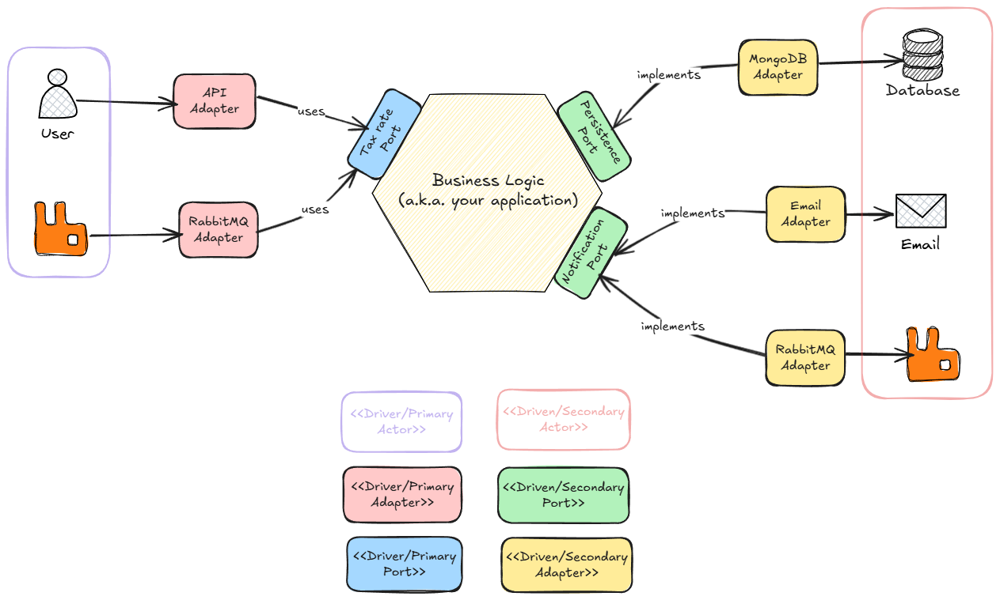

# Architecture

This is the architecture that we will use to implement this:

# Want to know more about it?

If you want to know more about Hexagonal Architecture and this practical example, checkout my content about it.

### Theory
- [Blog post](https://dev.to/rafaeljcamara/ports-and-adapters-hexagonal-architecture-547c)
- [Video](https://www.youtube.com/watch?v=DMS1EieXWMM)

### Practice
- [Blog post](https://dev.to/rafaeljcamara/ports-and-adapters-architecture-hexagonal-architecture-in-practice-with-net-1ibe)
- [Video](https://youtu.be/ld6epROxDcA)